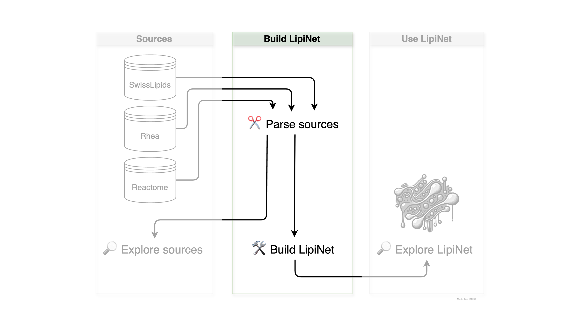

# Build LipiNet

This section includes notebooks for each of the resources that have been parsed to build LipiNet, as well as an overall integration notebook with the current network build showing how each resource was joined.

```{toctree}
---
maxdepth: 1
titlesonly: true
---
notebooks/build_lipinet.ipynb
notebooks/parsing_swisslipids.ipynb
notebooks/parsing_rhea.ipynb
notebooks/parsing_reactome.ipynb
```

