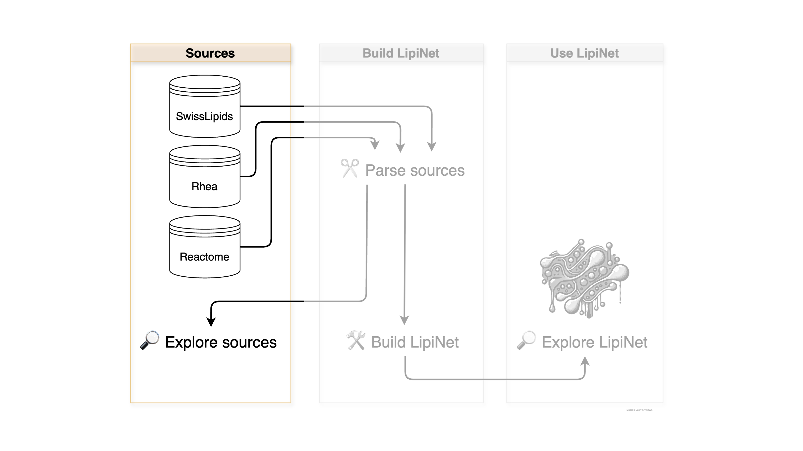

# Explore Sources

This section contains notebooks where users can begin to explore and better undertstand the resources that have been parsed to build LipiNet.

```{toctree}
---
maxdepth: 1
titlesonly: true
---
notebooks/explore_swisslipids.ipynb
notebooks/explore_rhea.ipynb
notebooks/explore_reactome.ipynb
```

