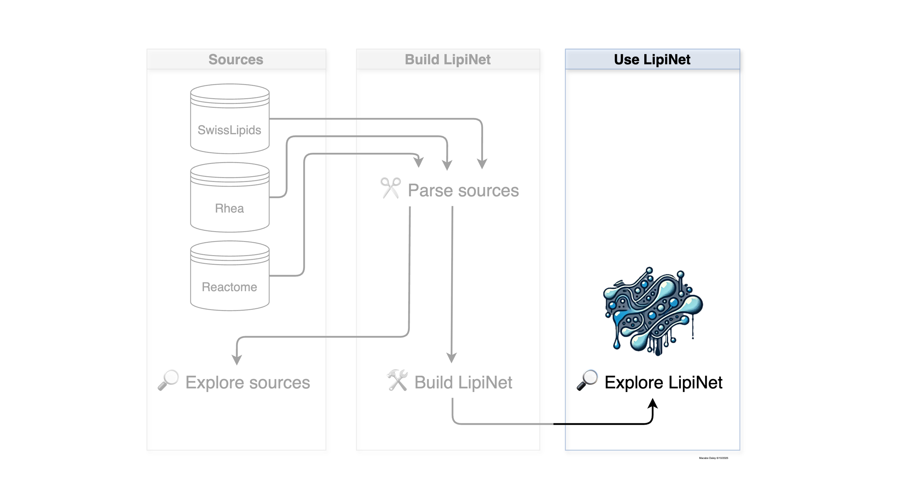

# Use LipiNet

This section includes a worked example of how to use LipiNet, including filtering, inspecting connections, generating visualisations, exporting the network, and more.

```{toctree}
---
maxdepth: 1
titlesonly: true
---
notebooks/explore_lipinet.ipynb
```

