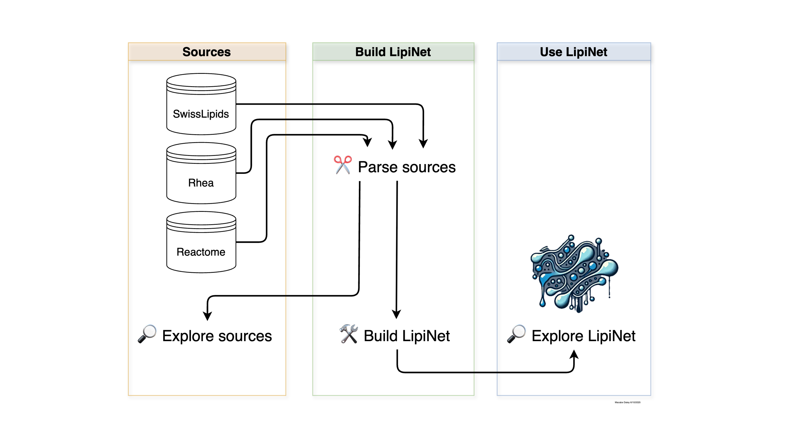

# Quick Start

The general framework for LipiNet follows a simple three-stage process for building and exploring lipid-centric knowledge networks:

1.	__Parse and standardize datasets__ - Import lipid-related information from key biochemical resources such as SwissLipids, Rhea, and Reactome. These data are cleaned, harmonized, and converted into graph-ready formats.
2.	__Explore and analyse the data__ - Investigate parsed data to understand lipid classes, biochemical reactions, and molecular relationships. This step includes generating network representations and basic analyses to reveal structure and connectivity.
3.	__Integrate and extend the network__ - Combining multiple parsed sources into a single unified lipid knowledge graph, enabling cross-database queries, pathway-level insights, and advanced visualisations for downstream analyses.

