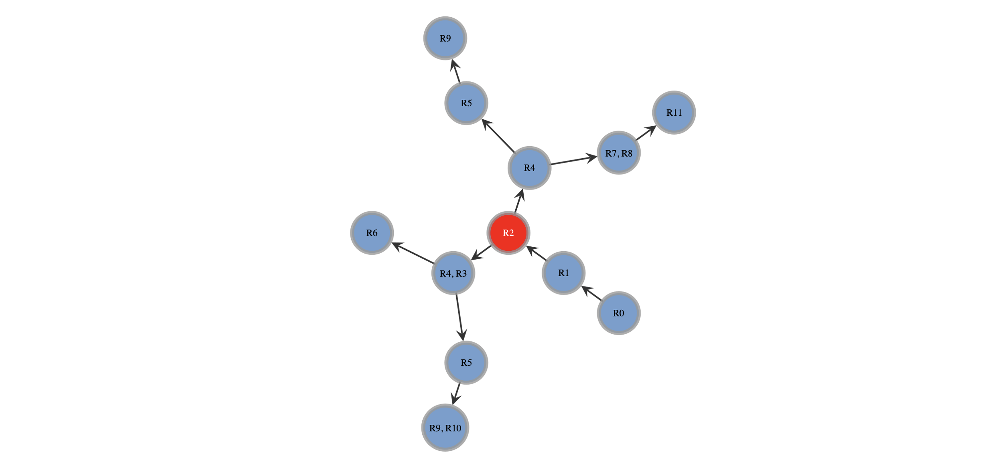
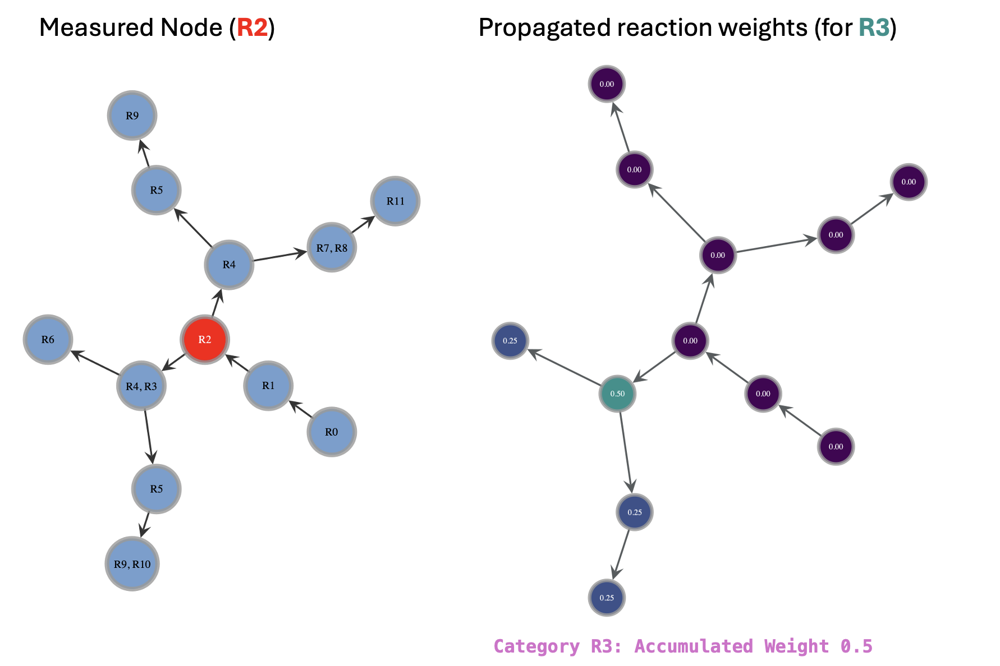
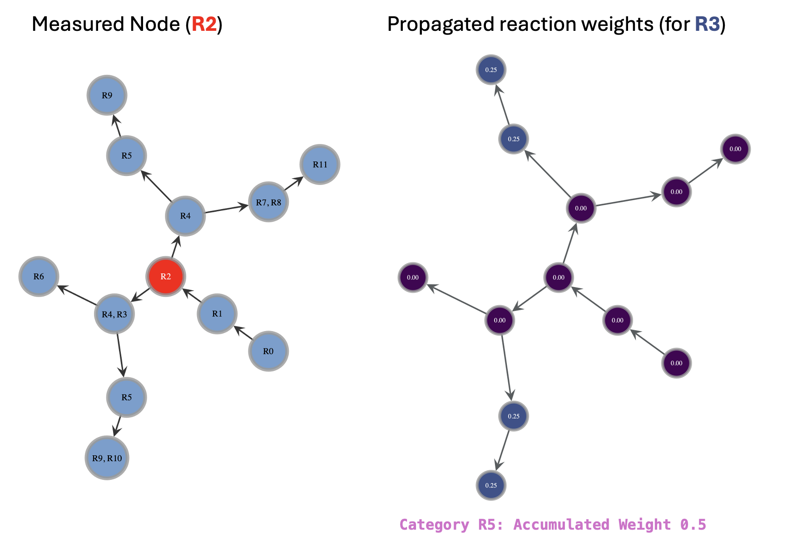

# LipiNet (Lipids PKN)*
*_(The LipiNet name is a placeholder for now, might be changed down the line)_

<!-- badges: start -->

<!-- badges: end -->

## Context

The lipidomics field faces unique challenges in standardizing its nomenclature and measurement precision, unlike genomics, transcriptomics, and proteomics, which have relatively consistent units of measurement (genes, transcripts, proteins). In lipidomics, measurement limitations frequently prevent analysts from identifying lipids at precise structural or isomeric subspecies levels. Consequently, lipid identification often relies on generalized representations, such as abstract class or species names aligned with established ontologies. This, along with variations in database standards, creates a particularly fragmented and complex landscape for prior knowledge in lipidomics.

LipiNet is designed to address these challenges by integrating information across disparate lipidomics databases, each with different identifiers and varying levels of lipid resolution. By unifying these resources and accounting for the inherent ambiguity in lipid identification, LipiNet enables more cohesive and comprehensive network analyses across lipidomics databases.

## Core features 

- Multi-layered network construction and analysis 
- Cross-database lipid identifier integration 
- Tools for node property propagation, community detection, network-based link inference, and modelling with prior knowledge 

## Getting started

You can currently install using pip via GitHub, or alternatively through local installation.

GitHub
1. `pip install git+https://github.com/saezlab/lipinet.git`

Local installation 
1. download locally and navigate to the directory where `setup.py` is located
2. install as an editable package: `pip install -e .`

## Roadmap 

Phase 1: Core network development 
1. Establish network architecture 
2. Define node properties 

Phase 2: Basic analysis functionality 
1. Filtering capabilities 
2. Path condensation

Phase 3: Advanced network and structural analysis 
1. Network transformation
2. Missing link inference 
3. Community detection

Phase 4: Measured data integration and statistical modelling 
1. Node property categorisation and conditional inference 
2. Statistical modelling 

## Usage examples 

#### Node property propagation from measured lipid

Imagine we have a hierarchical lipid ontology shown here by relationships from higher level classes to more specific lower levels of the hierarchy. 

Then consider that we have properties associated with these nodes, which in our case will be reactions, but it could also be associated enzymes, pathways, genes, etc. 

Now, if we measure in our experimental data one of these mid-level nodes, we want to know to what extent these properties are associated with our measured data. 

If there are properties directly associated with the exact same lipid as our measured lipid, then of course we can use these properties in our network. For example, if they were reactions, we would have 100% certainty that the measured lipid was involved in those reactions (ignoring measurement or database error for now).

Also, if the measured lipid is 'lower' in the hierarchy than other nodes, and the upper nodes have properties assigned to them, then we can assume that the same properties also apply parent class. So for example, we can assume that the specific sub-class of lipid is involved in the same reactions as the parent lipid class is. We'll inherit these reactions and give them a 100% probability of applying to our measured lipid.

But what if the measured lipid is 'higher' than other children nodes with node properties associated to them? If these were reactions, can we assume that the measured lipid participates in the same reactions as those more specific lipid representations? Well possibly, but not necessarily, because our measured lipid is just a higher level representation or abstraction of what is, in reality, a specific lipid with a defined physical entity and defined structure. Furthermore, it might not just be one lipid, it could be multiple types of specific lipids that fall into the same umbrella category as our measured lipid. To account for all these possibilities, in a naive implementation, we could apply conditional probability and a uniform distribution to all possible categories at each level of the children nodes and weight the probability that those node properties are associated with our measured lipid. We will call this 'downstream inference'.

In a simple example of this downstream inference, we have a reaction associated with a mid-level lipid, and the weight is assigned as 0.5 because taking into account our uniform assumptions, there is a 50% probability of those reactions actually being involved, given that we have experiemental data on the measured lipid.

For a more nuanced example, we have to consider that it is very possible and even likely, that some node properties, be it reactions, enzymes, etc. will be mapped to many nodes across separate branches. In this case, the importance in summing up the probabilities across all terminal nodes should become more clear, because it reflects the overall probability of those reactions being involved given the measured lipid.

This approach to node property propagation allows LipiNet to estimate the likelihood that various biological properties (e.g., reactions, pathways) are relevant to experimentally measured lipids, even when precise structural data isn’t available. By leveraging hierarchical relationships and conditional probability, we can infer the functional roles of more generalized lipid classes and better contextualize experimental findings within a lipid network.

The downstream inference methodology, as demonstrated, provides a probabilistic framework for propagating properties across hierarchical lipid ontologies. This can aid in identifying potential lipid functions, interactions, and biological roles in the context of broader lipidomics research, and it ultimately contributes to a more integrated and nuanced understanding of lipid metabolism, signaling, and regulatory processes.

## Liscence

GNU GENERAL PUBLIC LICENSE, Version 3, 29 June 2007

## Citation
We can add a manual citation here, when we change it to public.
